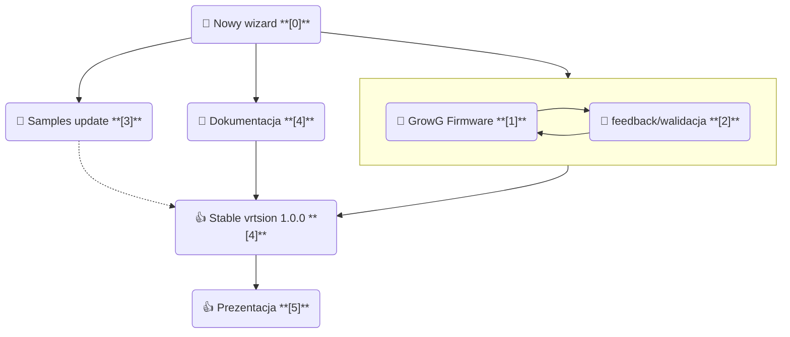

```mermaid
graph TB
  WIZ("🔮 Nowy wizard **[0]**")
  subgraph G[" "]
    GF("🌱 GrowG Firmware **[1]**")
    GW("🤔 feedback/walidacja **[2]**")
    GF --> GW --> GF
  end
  SU("🧪 Samples update **[3]**")
  DOC("📝 Dokumentacja **[4]**")
  OK("👍 Stable vrtsion 1.0.0 **[4]**")
  GO("👍 Prezentacja **[5]**")
  WIZ --> SU -.-> OK
  WIZ --> DOC --> OK
  WIZ --> G --> OK --> GO
```